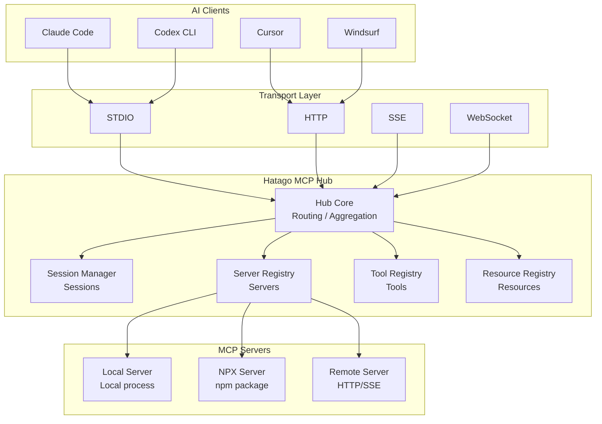
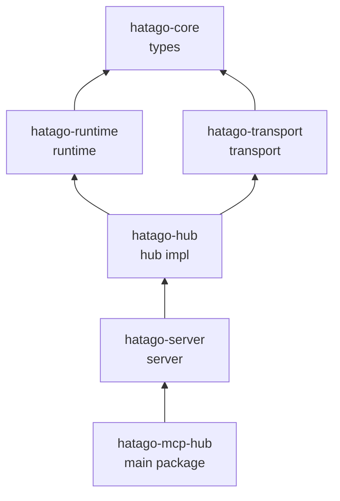

import { Aside } from '@astrojs/starlight/components';

## Principles

- Lightweight core
- Transparent MCP forwarding
- Extensible transports and servers

## System Overview



## Package Dependencies



## Security & Performance

- Process isolation per child server
- Lazy initialization
- Optional metrics endpoint in HTTP mode (`/metrics`, opt‑in via `HATAGO_METRICS=1`)

See also: [Data Flow](/en/explanation/data-flow/) (coming soon), [Config Reference](/en/reference/config/).

## Core Components

```ts
class Hub {
  // Lifecycle
  async start(options: HubOptions): Promise<void>;
  async stop(): Promise<void>;

  // Request handling
  async handleRequest(req: JSONRPCRequest): Promise<JSONRPCResponse>;

  // Notification forwarding
  async forwardNotification(n: JSONRPCNotification): Promise<void>;
}
```

Responsibilities:

- Manage child server lifecycle
- Route requests to the right server
- Aggregate tools/resources/prompts
- Forward progress and other notifications

### Server Registry

```ts
interface ServerRegistry {
  registerLocal(id: string, cfg: LocalConfig): void;
  registerNPX(id: string, cfg: NPXConfig): void;
  registerRemote(id: string, cfg: RemoteConfig): void;
}
```

### Session Manager

```ts
interface SessionManager {
  createSession(clientId: string): Session;
  getServerInstance(sessionId: string, serverId: string): MCPServer;
  destroySession(sessionId: string): void;
}
```

<Aside type="tip">Each session owns its server instances, so data does not leak across clients.</Aside>

## Performance

### Lazy init

```ts
async callTool(name: string, args: any) {
  const server = await this.lazyInitServer(name);
  return server.callTool(name, args);
}
```

### Connection pooling (remote)

```ts
class ConnectionPool {
  private connections = new Map<string, Connection>();
  async getConnection(url: string) {
    if (this.connections.has(url)) return this.connections.get(url)!;
    const conn = await this.createConnection(url);
    this.connections.set(url, conn);
    return conn;
  }
}
```

## Extension Points

```ts
class CustomServer implements MCPServer {
  async initialize(cfg: CustomConfig) {/* ... */}
  async listTools() {/* ... */}
  async callTool(name: string, args: any) {/* ... */}
}

registry.register('custom', CustomServer);
```

Custom transports can implement a common `Transport` interface and be plugged under the hub.

## Roadmap (high level)

- Short‑term: improved error recovery, perf insights, Bun/Deno adapters
- Long‑term: WASM, browser runtime, distributed clustering

## Internal Resource

- `hatago://servers` — JSON snapshot of connected servers (id/status/type/tools/resources/prompts).

## Related

- [Data Flow](/en/explanation/data-flow/)
- [Config Reference](/en/reference/config/)
