import { Card, CardGrid, Aside, Steps, Tabs, TabItem } from '@astrojs/starlight/components';

Understanding Hatago’s data flow makes troubleshooting and performance tuning much easier.

## Basic Data Flow

### Minimal setup

```mermaid
flowchart LR
    Client[AI Client\nClaude/Cursor]
    Hub[Hatago Hub\n📍Obs#1]
    Server[MCP Server\n📍Obs#2]

    Client -->|1. Request\nJSON‑RPC| Hub
    Hub -->|2. Forward| Server
    Server -->|3. Response| Hub
    Hub -->|4. Aggregate| Client

    style Hub fill:#ff6b35,stroke:#333,stroke-width:2px
    style Client fill:#e8f4fd
    style Server fill:#e8f4fd
```



### Observation points

| Point | What you see | Typical errors | How to see it |
| --- | --- | --- | --- |
| 📍1: Hub input | Request payload, timestamps | JSON parse, auth | `--verbose` |
| 📍2: Server I/O | Forwarded req, latency | timeout, connect | `--verbose` |
| 📍3: Hub output | Aggregated response | transform errors | `--verbose` |

## Message Flow (tools/list)

```mermaid
sequenceDiagram
    participant C as Client
    participant H as Hub
    participant S1 as Server 1
    participant S2 as Server 2

    C->>H: tools/list
    Note over H: 📍log: Request received

    par parallel
        H->>S1: tools/list
        S1-->>H: [tool1, tool2]
    and
        H->>S2: tools/list
        S2-->>H: [tool3, tool4]
    end

    Note over H: 📍log: Aggregating results
    H-->>C: [tool1, tool2, tool3, tool4]
    Note over H: 📍log: Response sent
```



## Error Flow (layers)

```mermaid
flowchart TD
    Start[Request received] --> Parse{JSON parse}
    Parse -->|ok| Route[Route]
    Parse -->|fail| E1[Invalid JSON\n📍Hub input]

    Route --> Auth{Auth?}
    Auth -->|ok| Forward[Forward]
    Auth -->|fail| E2[Unauthorized\n📍Hub auth]

    Forward --> Wait{Response}
    Wait -->|ok| Aggregate[Aggregate]
    Wait -->|timeout| E3[Timeout\n📍Server I/O]
    Wait -->|connect| E4[Connection failed\n📍Network]

    Aggregate --> Send[Send]
    Send -->|ok| End[Done]
    Send -->|fail| E5[Send failed\n📍Hub output]

    style E1 fill:#ffcccc
    style E2 fill:#ffcccc
    style E3 fill:#ffcccc
    style E4 fill:#ffcccc
    style E5 fill:#ffcccc
```



## Observability

### 1) Log levels

<Tabs>
  <TabItem label="info (default)">

  ```bash
  hatago serve  # default log level is roughly "info"
  ```

  Typical output: server start/stop, major errors, connection state changes.
  </TabItem>

  <TabItem label="verbose">

  ```bash
  hatago serve --verbose
  ```

  Shows request/response details, env expansion, config parsing, and timing markers.
  </TabItem>
</Tabs>

### 2) Real‑time monitoring

```bash
# Mirror logs and keep a file
hatago serve --verbose 2>&1 | tee hatago.log

# Watch for warnings and timeouts
hatago serve --verbose 2>&1 | grep -E "(ERROR|WARN|timeout)"

# Timestamp each line (requires moreutils `ts`)
hatago serve --verbose 2>&1 | ts '[%Y-%m-%d %H:%M:%S]'
```

### 3) Minimal metrics (HTTP mode, opt‑in)

Enable with `HATAGO_METRICS=1`, then fetch `/metrics`.

```bash
HATAGO_METRICS=1 hatago serve --http --port 3535
curl -s http://127.0.0.1:3535/metrics | jq .
```

### Example: micro metrics collector

```javascript title="scripts/monitor-hatago.js"
const { spawn } = require('child_process');
const readline = require('readline');

const metrics = { requests: 0, responses: 0, errors: 0, totalTime: 0 };
const hatago = spawn('npx', ['@himorishige/hatago-mcp-hub', 'serve', '--verbose'], { stdio: ['pipe','pipe','pipe'] });
const rl = readline.createInterface({ input: hatago.stderr, crlfDelay: Infinity });

rl.on('line', (line) => {
  if (line.includes('Received request')) metrics.requests++;
  if (line.includes('Response sent')) metrics.responses++;
  if (line.includes('ERROR')) metrics.errors++;
  const m = line.match(/\((\d+)ms\)/); if (m) metrics.totalTime += parseInt(m[1]);
  if (metrics.requests && metrics.requests % 10 === 0) {
    console.log({ ...metrics, avgMs: metrics.totalTime / (metrics.responses || 1) });
  }
});
```

## Failure Layers — quick diagnosis

| Layer | Symptom | Command | First action |
| --- | --- | --- | --- |
| 1. Startup | `command not found` | `which hatago` | Check PATH or use `npx @.../hatago-mcp-hub` |
| 2. Config | `Invalid config` | `cat hatago.config.json | jq .` | Fix JSON |
| 3. Env | `${VAR} not found` | `echo $VAR` | Export or set in `.env` |
| 4. Server spawn | `spawn ENOENT` | `which npx` | Use absolute path if needed |
| 5. Network | `ECONNREFUSED` | `curl -I <url>` | Verify URL/firewall |
| 6. Auth | `401 Unauthorized` | `echo $API_TOKEN` | Refresh token / scopes |
| 7. Timeout | `Request timeout` | `time curl <url>` | Increase timeout / retry |

## Performance: quick timing

```bash
# Extract timing markers from verbose logs
hatago serve --verbose 2>&1 \
  | grep -oE '\\(([^)]*)ms\\)' \
  | grep -oE '[0-9]+' \
  | awk '{sum+=$1; n++} END{print "avg:", (n?sum/n:0) "ms"}'
```

### Visualizing where time goes


## Troubleshooting helper

```bash title="scripts/diagnose-hatago.sh"
#!/usr/bin/env bash

echo "🔍 Hatago diagnose"
echo "Node.js: $(node --version)"
echo "npm: $(npm --version)"
echo "Hatago: $(npx @himorishige/hatago-mcp-hub --version 2>/dev/null || echo 'Not installed')"

echo "\n📄 Config:"
if [ -f hatago-config.json ]; then
  jq . hatago-config.json >/dev/null 2>&1 && echo "✅ Valid JSON" || echo "❌ Invalid JSON"
  echo "Servers: $(jq '.mcpServers | length' hatago-config.json)"
else
  echo "❌ hatago-config.json not found"
fi

echo "\n🌐 Quick check:"
echo '{"jsonrpc":"2.0","method":"_internal_hatago_status","id":1,"params":{}}' \
 | timeout 5 npx @himorishige/hatago-mcp-hub serve --stdio 2>/dev/null \
 | jq -r '.result.status' \
 | grep -q "ready" && echo "✅ Hub is ready" || echo "❌ Hub not responding"
```

## Related

<CardGrid>
  <Card title="Architecture" icon="document" href="/en/explanation/architecture/" />
  <Card title="Troubleshooting" icon="warning" href="/en/troubleshooting/" />
  <Card title="Config Reference" icon="rocket" href="/en/reference/config/" />
</CardGrid>
