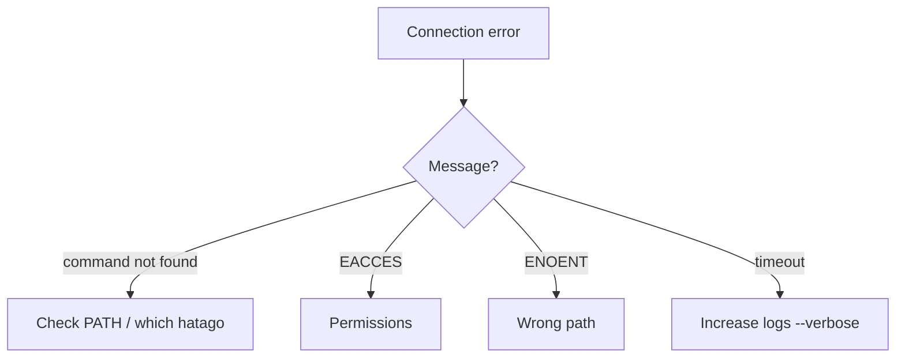

import { Card, CardGrid, Steps, Tabs, TabItem, Aside, Code } from '@astrojs/starlight/components';

Set up Hatago MCP Hub inside an existing Node.js project and reach a practical, shareable setup fast.

## 🎯 Goals

- Hatago integrated into your project
- At least one MCP server connected
- Environment separation via tags
- Self‑diagnosis steps for errors
- Ready to share with the team

## ✅ Preflight

<Steps>
1. Node version
   ```bash
   node --version  # v20.0.0+
   ```
2. In project root
   ```bash
   pwd && ls package.json
   ```
3. (Optional) Global prefix
   ```bash
   npm config get prefix
   ```
</Steps>

## 🚀 Step 1: Install (2 min)

<Tabs>
  <TabItem label="npm (recommended)">

  ```bash
  npm install --save-dev @himorishige/hatago-mcp-hub

  # Add scripts
  npm pkg set scripts.mcp="hatago serve"
  npm pkg set scripts.mcp:dev="nodemon --exec 'hatago serve --tags dev' --watch hatago.config.json"
  npm pkg set scripts.mcp:prod="hatago serve --tags production"
  ```
  </TabItem>

  <TabItem label="pnpm">

  ```bash
  pnpm add -D @himorishige/hatago-mcp-hub
  pnpm pkg set scripts.mcp="hatago serve"
  pnpm pkg set scripts.mcp:dev="nodemon --exec 'hatago serve --tags dev' --watch hatago.config.json"
  pnpm pkg set scripts.mcp:prod="hatago serve --tags production"
  ```
  </TabItem>

  <TabItem label="yarn">

  ```bash
  yarn add -D @himorishige/hatago-mcp-hub
  # Add scripts manually to package.json
  ```
  </TabItem>
</Tabs>

## 🔧 Step 2: Init (3 min)

<Steps>
1. Create config
   ```bash
   npx @himorishige/hatago-mcp-hub init --mode stdio
   ```
2. Create env file
   ```bash
   cat > .env.local << 'EOF'
   # Hatago MCP Hub
   MCP_LOG_LEVEL=info
   NODE_ENV=development
   # OPENAI_API_KEY=sk-...
   # GITHUB_TOKEN=ghp_...
   EOF
   ```
3. gitignore
   ```bash
   echo -e "\n# Hatago MCP Hub\nhatago-config.local.json\n.env.local" >> .gitignore
   ```
</Steps>

## 📦 Step 3: First server (5 min)

<Steps>
1. Edit config
   ```json title="hatago-config.json"
   {
     "$schema": "https://raw.githubusercontent.com/himorishige/hatago-hub/main/schemas/config.schema.json",
     "version": 1,
     "logLevel": "info",
     "mcpServers": {
       "filesystem-local": {
         "command": "npx",
         "args": ["-y", "@modelcontextprotocol/server-filesystem", "./src"],
         "cwd": ".",
         "tags": ["dev", "local", "filesystem"],
         "env": { "NODE_ENV": "${NODE_ENV:-development}" }
       }
     }
   }
   ```
2. Run
   ```bash
   npm run mcp:dev
   ```
3. Direct check
   ```bash
   echo '{"jsonrpc":"2.0","method":"tools/list","id":1,"params":{}}' | npx @himorishige/hatago-mcp-hub serve --stdio
   ```
</Steps>

## 🏷️ Step 4: Environments via tags (5 min)

Add dev/mock/prod servers and start with tags.

```json title="hatago-config.json" ins={10-26}
{
  "mcpServers": {
    "filesystem-local": {
      "command": "npx",
      "args": ["-y", "@modelcontextprotocol/server-filesystem", "./src"],
      "tags": ["dev", "local", "filesystem"]
    },
    "mock-api": {
      "command": "node",
      "args": ["./scripts/mock-server.js"],
      "tags": ["dev", "mock", "api"],
      "disabled": false
    },
    "production-api": {
      "url": "https://api.production.example.com/mcp",
      "type": "http",
      "headers": { "Authorization": "Bearer ${PROD_API_TOKEN}" },
      "tags": ["production", "api", "remote"],
      "disabled": false
    }
  }
}
```

Start by environment:

```bash
npm run mcp:dev
PROD_API_TOKEN=xxx npm run mcp:prod
```

## 🧪 Step 5: Verify (5 min)

Create a tiny verification script:

```javascript title="scripts/verify-hatago.js"
#!/usr/bin/env node
const { spawn } = require('child_process');
const readline = require('readline');
async function verify() {
  const tests = [
    { name: 'read servers resource', req: { jsonrpc: '2.0', method: 'resources/read', id: 1, params: { uri: 'hatago://servers' } } }
  ];
  const hatago = spawn('npx', ['@himorishige/hatago-mcp-hub', 'serve', '--stdio'], { stdio: ['pipe','pipe','pipe'] });
  const rl = readline.createInterface({ input: hatago.stdout, crlfDelay: Infinity });
  let i = 0; hatago.stdin.write(JSON.stringify(tests[0].req)+'\n');
  rl.on('line', (line) => {
    try {
      const res = JSON.parse(line); console.log('✅', tests[i].name);
      if (++i < tests.length) hatago.stdin.write(JSON.stringify(tests[i].req)+'\n'); else { console.log('🎉 done'); hatago.kill(); process.exit(0); }
    } catch (e) { console.error('❌', e.message); hatago.kill(); process.exit(1); }
  });
}
verify().catch(console.error);
```

Run it:

```bash
node scripts/verify-hatago.js
```

## 🚨 Troubleshooting



Common fixes:

| Error | Cause | Fix |
|---|---|---|
| `ENOENT: hatago-config.json` | Missing config | `npx @himorishige/hatago-mcp-hub init` |
| `Invalid JSON` | Broken config | Validate JSON |
| `${VAR} not found` | Missing env | Export or set in `.env.local` |
| `Server failed to start` | Child server error | Run with `--verbose` |

## 📤 Step 6: Share with the team (5 min)

<Steps>
1. Template config
   ```bash
   cp hatago-config.json hatago-config.example.json
   ```
2. Env template
   ```bash
   cp .env.local .env.example
   ```
3. README snippet
   ```markdown title="README.md" ins={5-15}
   ## MCP Hub Setup
   1. Install deps: `npm install`
   2. Copy config: `cp hatago-config.example.json hatago-config.json`
   3. Copy env: `cp .env.example .env.local`
   4. Fill `.env.local`
   5. Start: `npm run mcp:dev`
   ```
</Steps>

## ✅ Checklist

- [ ] Hatago installed
- [ ] Config created
- [ ] At least one server connected
- [ ] Tag‑based environments set
- [ ] Verification script passes
- [ ] Team docs ready

## 🎯 Next

<CardGrid>
  <Card title="Tag Filtering" icon="tag" href="/en/how-to/tag-filtering/" />
  <Card title="Remote Servers" icon="globe" href="/en/how-to/remote-servers/" />
  <Card title="Config Inheritance" icon="document" href="/en/how-to/config-inheritance/" />
</CardGrid>

---

<Aside type="tip">
  Need help? Open an issue on GitHub: https://github.com/himorishige/hatago-hub/issues
 </Aside>
