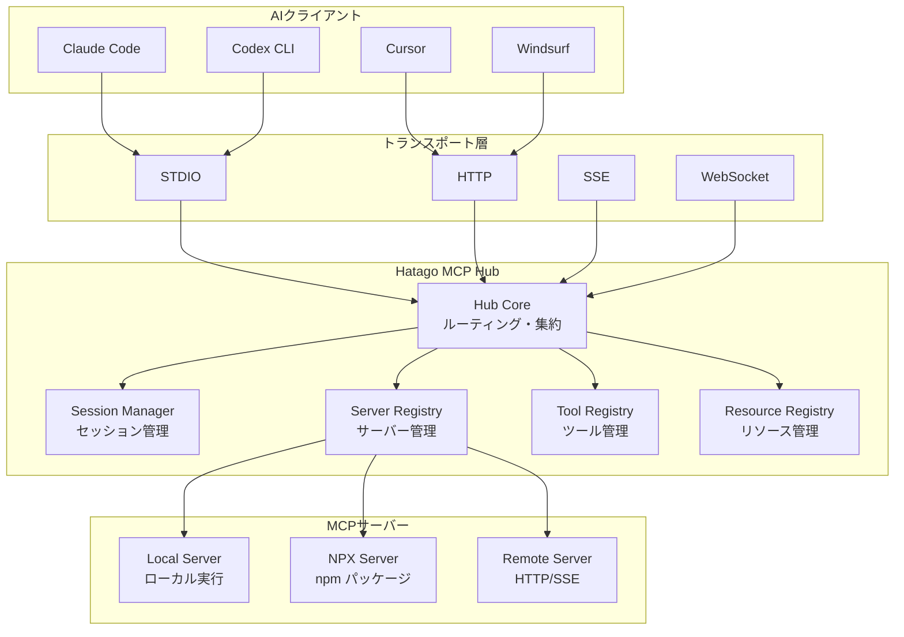
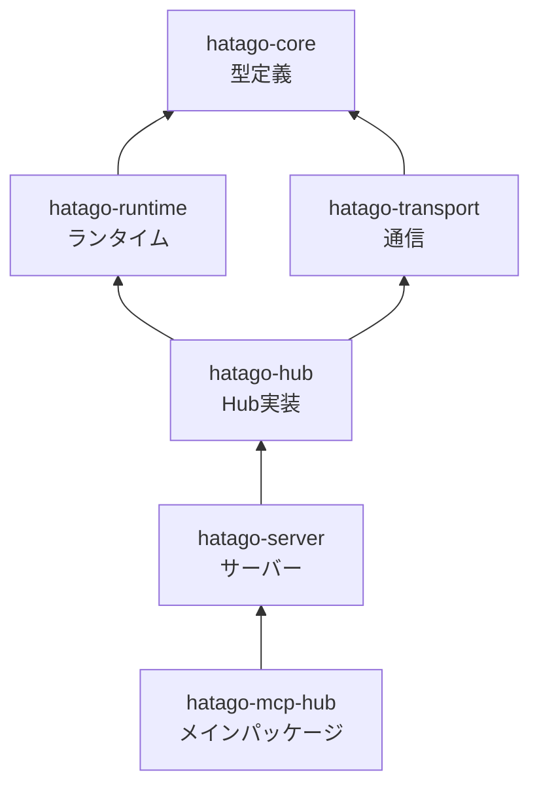
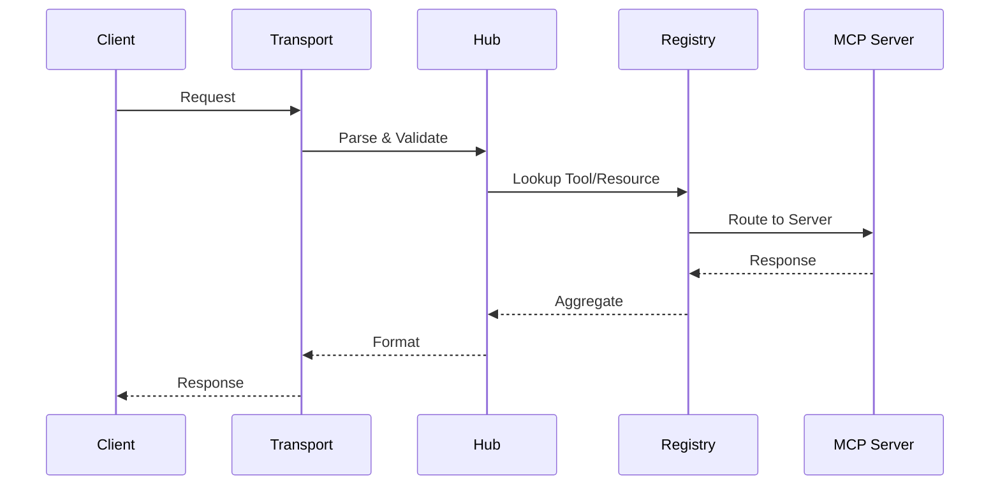
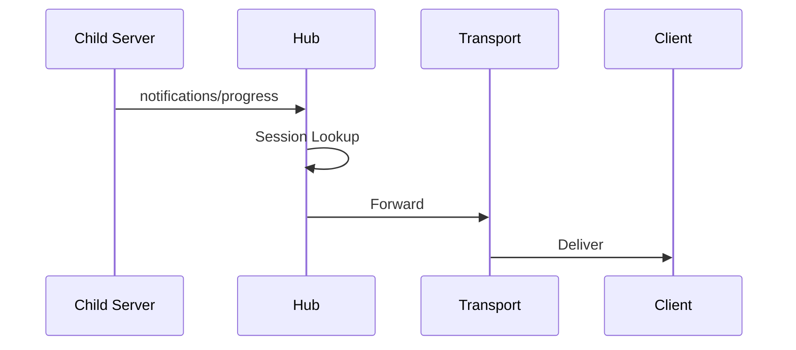

import { Card, CardGrid, Aside } from '@astrojs/starlight/components';

Hatago MCP Hubは、複数のMCPサーバーを統合管理するための軽量なハブサーバーです。シンプルさと拡張性のバランスを重視した設計になっています。

## 🎯 設計思想

Hatagoの設計は以下の原則に基づいています：

<CardGrid>
  <Card title="軽量性" icon="rocket">
    必要最小限の機能に集中し、コア実装を約500行に収める
  </Card>
  <Card title="拡張性" icon="puzzle">
    新しいサーバータイプやトランスポートを簡単に追加可能
  </Card>
  <Card title="透過性" icon="magnifier">
    MCPプロトコルを透過的に中継し、不必要な変換を避ける
  </Card>
  <Card title="独立性" icon="shield">
    各サーバーは独立したプロセスで動作し、相互に影響しない
  </Card>
</CardGrid>

## 🏗️ システム構成



## 📦 パッケージ構成

プロジェクトはモノレポ構造で、各パッケージが明確な責務を持ちます：

### コアパッケージ

| パッケージ                   | 責務              | 主要ファイル          |
| ---------------------------- | ----------------- | --------------------- |
| `@himorishige/hatago-hub`    | Hub本体の実装     | `hub.ts` (~500行)     |
| `@himorishige/hatago-server` | サーバー実装とCLI | `server.ts`, `cli.ts` |
| `@himorishige/hatago-core`   | 共通の型定義      | `types.ts`            |

### サポートパッケージ

| パッケージ                      | 責務                     | 役割                         |
| ------------------------------- | ------------------------ | ---------------------------- |
| `@himorishige/hatago-runtime`   | ランタイムコンポーネント | セッション、レジストリ管理   |
| `@himorishige/hatago-transport` | 通信層                   | STDIO, HTTP, SSE実装         |
| `@himorishige/hatago-mcp-hub`   | メインnpmパッケージ      | ユーザー向けエントリポイント |

### 依存関係



## 🔧 コア コンポーネント

### Hub（中核）

Hubは全体の調整役として機能します：

```typescript
class Hub {
  // サーバー管理
  async start(options: HubOptions): Promise<void>;
  async stop(): Promise<void>;

  // リクエスト処理
  async handleRequest(request: JSONRPCRequest): Promise<JSONRPCResponse>;

  // 通知転送
  async forwardNotification(notification: JSONRPCNotification): void;
}
```

**主要な責務：**

- サーバーのライフサイクル管理
- リクエストの適切なサーバーへのルーティング
- ツール/リソース/プロンプトの集約
- 通知の透過的な転送

### Server Registry

異なるタイプのサーバーを統一的に管理：

```typescript
interface ServerRegistry {
  // ローカルサーバー（コマンド実行）
  registerLocal(id: string, config: LocalConfig): void;

  // NPXサーバー（npmパッケージ）
  registerNPX(id: string, config: NPXConfig): void;

  // リモートサーバー（HTTP/SSE）
  registerRemote(id: string, config: RemoteConfig): void;
}
```

### Session Manager

複数のAIクライアントの同時接続をサポート：

```typescript
interface SessionManager {
  // セッション作成
  createSession(clientId: string): Session;

  // セッションごとのサーバーインスタンス
  getServerInstance(sessionId: string, serverId: string): MCPServer;

  // クリーンアップ
  destroySession(sessionId: string): void;
}
```

<Aside type="tip">
  各セッションは独立したサーバーインスタンスを持つため、クライアント間でデータが混在することはありません。
</Aside>

## 🔄 データフロー

### リクエスト処理フロー



### 通知転送フロー

進捗通知などを透過的に転送：



## 🛡️ セキュリティ設計

### プロセス分離

各MCPサーバーは独立したプロセスで実行：

- メモリ空間の分離
- クラッシュの局所化
- リソース制限の個別設定

### セッションセキュリティ

```typescript
// セッション固有のコンテキスト
interface SessionContext {
  id: string; // ユニークなセッションID
  clientId: string; // クライアント識別子
  servers: Map<string, MCPServer>; // 専用インスタンス
  createdAt: Date; // セッション開始時刻
}
```

## ⚡ パフォーマンス最適化

### 遅延初期化

サーバーは必要になるまで起動しない：

```typescript
// 実際にツールが呼ばれるまでサーバーは起動しない
async callTool(name: string, args: any) {
  const server = await this.lazyInitServer(name)
  return server.callTool(name, args)
}
```

### 接続プーリング

リモートサーバーへの接続を再利用：

```typescript
class ConnectionPool {
  private connections: Map<string, Connection>;

  async getConnection(url: string): Promise<Connection> {
    // 既存の接続を再利用
    if (this.connections.has(url)) {
      return this.connections.get(url);
    }
    // 新規接続を作成してプール
    const conn = await this.createConnection(url);
    this.connections.set(url, conn);
    return conn;
  }
}
```

## 🔌 拡張ポイント

### 新しいサーバータイプの追加

1. `MCPServer`インターフェースを実装
2. `ServerRegistry`に登録
3. 設定スキーマを更新

```typescript
class CustomServer implements MCPServer {
  async initialize(config: CustomConfig) {
    /* ... */
  }
  async listTools() {
    /* ... */
  }
  async callTool(name: string, args: any) {
    /* ... */
  }
}

registry.register('custom', CustomServer);
```

### カスタムトランスポート

```typescript
class CustomTransport implements Transport {
  async send(message: JSONRPCMessage) {
    /* ... */
  }
  async receive(): Promise<JSONRPCMessage> {
    /* ... */
  }
}
```

## 📈 バージョン進化

### v0.0.1 → v0.0.2

主な改善点：

- タグベースフィルタリング機能
- 38以上のファイルを削除してシンプル化
- コア実装を1000行以上から約500行に削減

### 将来のロードマップ

<CardGrid>
  <Card title="短期" icon="clock">
    - Bun/Denoネイティブサポート - エラー回復の強化 - パフォーマンス監視
  </Card>
  <Card title="長期" icon="rocket">
    - WebAssemblyサポート - ブラウザランタイム - 分散クラスタリング
  </Card>
</CardGrid>

## 🔍 内部リソース

Hatago には最小限の内部リソースが用意されています：

- `hatago://servers` — 現在接続中のサーバー一覧を JSON で提供します。

## 📚 関連ドキュメント

<CardGrid>
  <Card title="MCPプロトコル" icon="document" href="https://modelcontextprotocol.io/">
    公式プロトコルサイト
  </Card>
  <Card title="データフロー" icon="arrow-right" href="/ja/explanation/data-flow/">
    詳細なデータの流れ
  </Card>
  <Card title="設定リファレンス" icon="setting" href="/ja/reference/config/">
    設定オプション一覧
  </Card>
</CardGrid>
