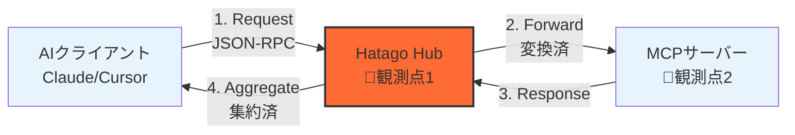
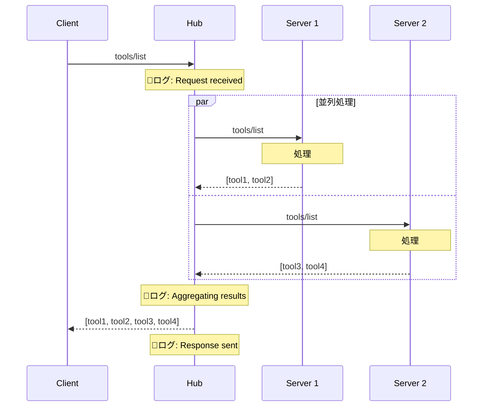
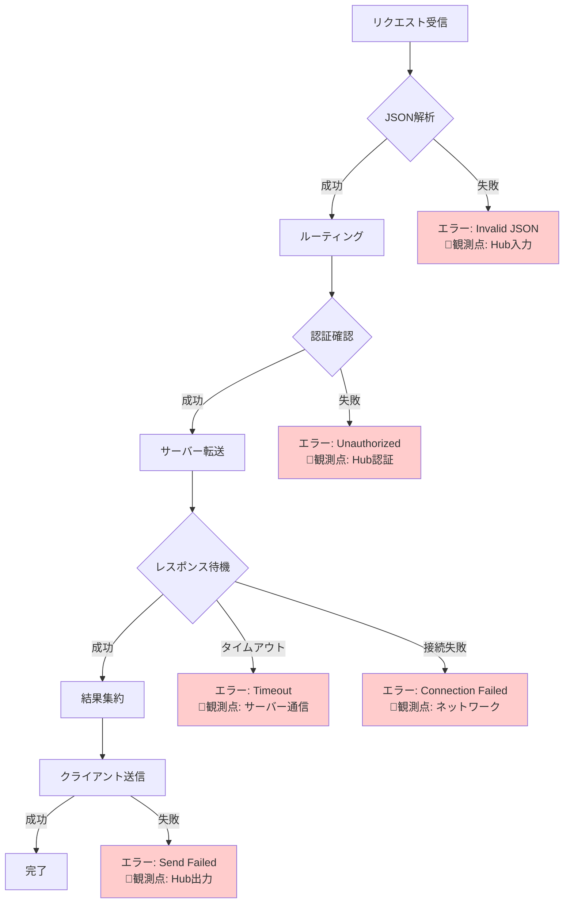
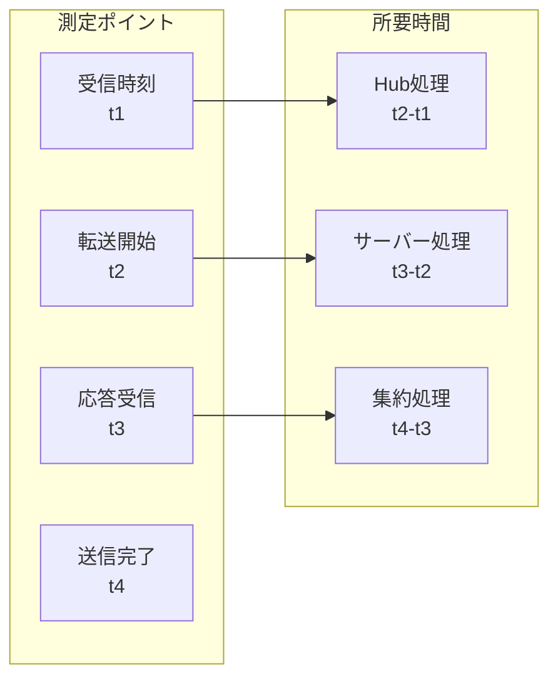

import { Card, CardGrid, Aside, Steps, Tabs, TabItem } from '@astrojs/starlight/components';

Hatago MCP Hubを経由するデータの流れを理解することで、トラブルシューティングとパフォーマンス最適化が容易になります。

## 📊 基本的なデータフロー

### 最小構成



### 観測可能なポイント

| 観測点                | 取得できる情報                 | 典型的なエラー           | ログコマンド        |
| --------------------- | ------------------------------ | ------------------------ | ------------------- |
| **📍1: Hub入力**      | リクエスト内容、タイムスタンプ | JSON解析エラー、認証失敗 | `--verbose`         |
| **📍2: サーバー通信** | 転送内容、レスポンス時間       | タイムアウト、接続拒否   | `--log-level debug` |
| **📍3: Hub出力**      | 集約結果、エラー内容           | 集約エラー、変換失敗     | `--verbose`         |

## 🔄 詳細なメッセージフロー

### リクエスト処理の流れ



### エラー発生時のフロー



## 🔍 観測方法

### 1. ログレベル別の情報

<Tabs>
<TabItem label="info（デフォルト）">
```bash
hatago serve --log-level info

# 表示される情報:

# - サーバー起動/停止

# - 主要なエラー

# - 接続状態の変化

```

**例:**
```

[INFO] Starting server: filesystem-local
[INFO] Hub ready on stdio
[ERROR] Server 'api-server' failed to start: Connection refused

````
</TabItem>

<TabItem label="debug">
```bash
hatago serve --log-level debug

# 表示される情報:
# - すべてのリクエスト/レスポンス
# - 内部処理の詳細
# - タイミング情報
````

**例:**

```
[DEBUG] Received request: {"jsonrpc":"2.0","method":"tools/list","id":1}
[DEBUG] Forwarding to server: filesystem-local
[DEBUG] Server response (125ms): {"result":[...]}
[DEBUG] Aggregated response sent to client
```

</TabItem>

<TabItem label="verbose">
```bash
hatago serve --verbose

# 表示される情報:

# - debugレベル＋

# - 環境変数の展開

# - 設定の解析過程

```

**例:**
```

[VERBOSE] Expanding env var: ${NODE_ENV} -> development
[VERBOSE] Loading config from: ./hatago-config.json
[VERBOSE] Parsed 3 servers, 2 active after tag filtering

````
</TabItem>
</Tabs>

### 2. リアルタイム監視

```bash
# ログをファイルに出力しながら監視
hatago serve --verbose 2>&1 | tee hatago.log

# 特定のパターンを監視
hatago serve --verbose 2>&1 | grep -E "(ERROR|WARN|timeout)"

# タイムスタンプ付きで記録
hatago serve --verbose 2>&1 | ts '[%Y-%m-%d %H:%M:%S]'
````

### 3. メトリクス取得スクリプト

```javascript title="scripts/monitor-hatago.js"
const { spawn } = require('child_process');
const readline = require('readline');

const metrics = {
  requests: 0,
  responses: 0,
  errors: 0,
  totalTime: 0,
  serverStats: {}
};

const hatago = spawn('npx', ['hatago', 'serve', '--verbose'], {
  stdio: ['pipe', 'pipe', 'pipe']
});

const rl = readline.createInterface({
  input: hatago.stderr,
  crlfDelay: Infinity
});

rl.on('line', (line) => {
  // リクエストカウント
  if (line.includes('Received request')) {
    metrics.requests++;
  }

  // レスポンスカウント
  if (line.includes('Response sent')) {
    metrics.responses++;
  }

  // エラーカウント
  if (line.includes('ERROR')) {
    metrics.errors++;
  }

  // レスポンス時間の抽出
  const timeMatch = line.match(/\((\d+)ms\)/);
  if (timeMatch) {
    metrics.totalTime += parseInt(timeMatch[1]);
  }

  // 定期的に統計を出力
  if (metrics.requests % 10 === 0) {
    console.log('📊 メトリクス:', {
      ...metrics,
      avgTime: metrics.totalTime / metrics.responses || 0
    });
  }
});
```

## 🚨 失敗レイヤーの診断

### レイヤー別エラー診断表

| レイヤー            | エラー症状          | 診断コマンド                     | 一次対応                     |
| ------------------- | ------------------- | -------------------------------- | ---------------------------- |
| **1. 起動**         | `command not found` | `which hatago`                   | PATHを確認、再インストール   |
| **2. 設定読込**     | `Invalid config`    | `cat hatago-config.json \| jq .` | JSON構文を修正               |
| **3. 環境変数**     | `${VAR} not found`  | `echo $VAR`                      | export設定、.envファイル確認 |
| **4. サーバー起動** | `spawn ENOENT`      | `ls -la $(which npx)`            | コマンドパスを絶対パスに     |
| **5. ネットワーク** | `ECONNREFUSED`      | `curl -I <url>`                  | URL確認、ファイアウォール    |
| **6. 認証**         | `401 Unauthorized`  | `echo $API_TOKEN`                | トークン設定、有効期限確認   |
| **7. タイムアウト** | `Request timeout`   | `time curl <url>`                | タイムアウト値を増やす       |

### エラー発生箇所の特定フロー

<Steps>
1. **エラーメッセージの確認**
   ```bash
   hatago serve --verbose 2>&1 | grep -A5 -B5 ERROR
   ```

2. **該当サーバーの個別テスト**

   ```bash
   # 問題のサーバーだけを有効化
   hatago serve --tags problem-server --verbose
   ```

3. **直接実行テスト**

   ```bash
   # Hubを介さず直接実行
   npx @modelcontextprotocol/server-filesystem .
   ```

4. **ネットワーク診断**

   ```bash
   # 接続性確認
   nc -zv api.example.com 443

   # DNS解決確認
   nslookup api.example.com
   ```
</Steps>

## 📈 パフォーマンス分析

### ボトルネック特定



### パフォーマンスログの解析

```bash
# タイミング情報を抽出
hatago serve --verbose 2>&1 | \
  grep -oP '\(\K\d+(?=ms)' | \
  awk '{sum+=$1; count++} END {print "平均応答時間: " sum/count "ms"}'

# サーバー別の応答時間
hatago serve --verbose 2>&1 | \
  grep -E "Server .+ response" | \
  awk '{print $2, $4}' | \
  sort | uniq -c
```

## 🛠️ トラブルシューティングツール

### 診断スクリプト

```bash title="scripts/diagnose-hatago.sh"
#!/bin/bash

echo "🔍 Hatago診断開始..."

# 1. 環境チェック
echo -e "\n📋 環境情報:"
echo "Node.js: $(node --version)"
echo "npm: $(npm --version)"
echo "Hatago: $(npx hatago --version 2>/dev/null || echo 'Not installed')"

# 2. 設定ファイルチェック
echo -e "\n📄 設定ファイル:"
if [ -f hatago-config.json ]; then
    jq . hatago-config.json >/dev/null 2>&1 && \
        echo "✅ Valid JSON" || \
        echo "❌ Invalid JSON"
    echo "サーバー数: $(jq '.mcpServers | length' hatago-config.json)"
else
    echo "❌ hatago-config.json not found"
fi

# 3. 環境変数チェック
echo -e "\n🔐 環境変数:"
for var in NODE_ENV GITHUB_TOKEN OPENAI_API_KEY; do
    if [ -z "${!var}" ]; then
        echo "⚠️  $var: Not set"
    else
        echo "✅ $var: Set (${#var} chars)"
    fi
done

# 4. 接続テスト
echo -e "\n🌐 接続テスト:"
echo '{"jsonrpc":"2.0","method":"_internal_hatago_status","id":1,"params":{}}' | \
    timeout 5 npx hatago serve --stdio 2>/dev/null | \
    jq -r '.result.status' | \
    grep -q "ready" && echo "✅ Hub is ready" || echo "❌ Hub not responding"

echo -e "\n✨ 診断完了"
```

## 📚 関連ドキュメント

<CardGrid>
  <Card title="アーキテクチャ詳細" icon="document" href="/ja/explanation/architecture/">
    システム設計の詳細
  </Card>
  <Card title="エラーカタログ" icon="warning" href="/ja/troubleshooting/error-catalog/">
    全エラー一覧と対処法
  </Card>
  <Card title="パフォーマンス最適化" icon="rocket" href="/ja/how-to/performance/">
    高速化のテクニック
  </Card>
</CardGrid>

<Aside type="tip">
  **プロのヒント**:
  `--verbose`ログをElasticsearchやDatadogに送信することで、本格的な観測可能性を実現できます。
</Aside>
