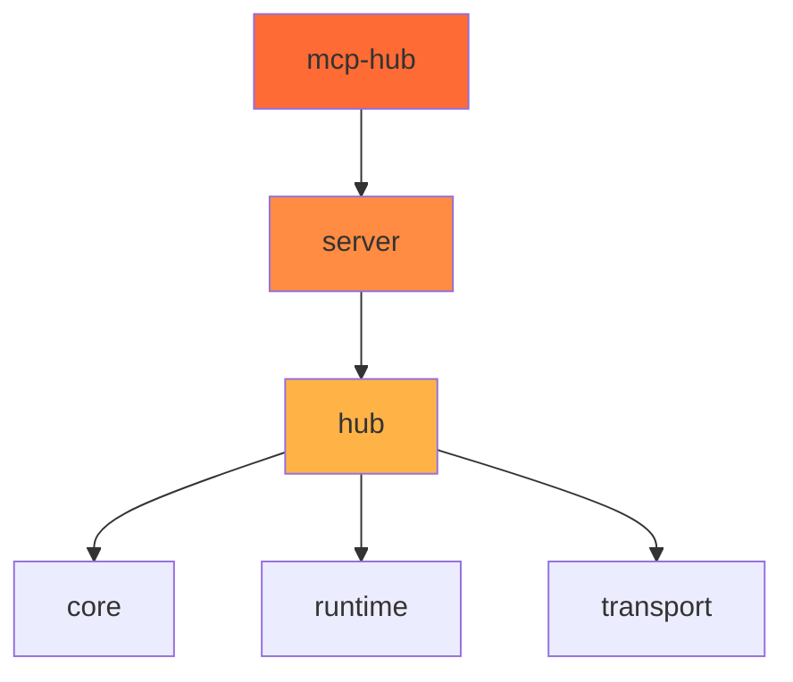

import { Card, CardGrid } from '@astrojs/starlight/components';

# パッケージ一覧

Hatago MCP Hubは複数のnpmパッケージで構成されています。各パッケージは独立してインストール・使用可能です。

<CardGrid>
  <Card title="@himorishige/hatago-core" icon="package" href="/ja/packages/core/">
    共通の型定義とインターフェース
  </Card>
  <Card title="@himorishige/hatago-mcp-hub" icon="package" href="/ja/packages/mcp-hub/">
    CLIツールとメインエントリーポイント
  </Card>
  <Card title="@himorishige/hatago-runtime" icon="package" href="/ja/packages/runtime/">
    ランタイムコンポーネント
  </Card>
  <Card title="@himorishige/hatago-server" icon="package" href="/ja/packages/server/">
    サーバー実装（HTTP/STDIO対応）
  </Card>
  <Card title="@himorishige/hatago-transport" icon="package" href="/ja/packages/transport/">
    トランスポート層の実装
  </Card>
</CardGrid>

## パッケージの関係図



## インストール方法

### すべてのパッケージを使用する場合

```bash
npm install @himorishige/hatago-mcp-hub
```

### 特定のパッケージのみ使用する場合

```bash
# Hubコアのみ
npm install @himorishige/hatago-hub

# サーバー実装のみ
npm install @himorishige/hatago-server

# 型定義のみ
npm install @himorishige/hatago-core
```
