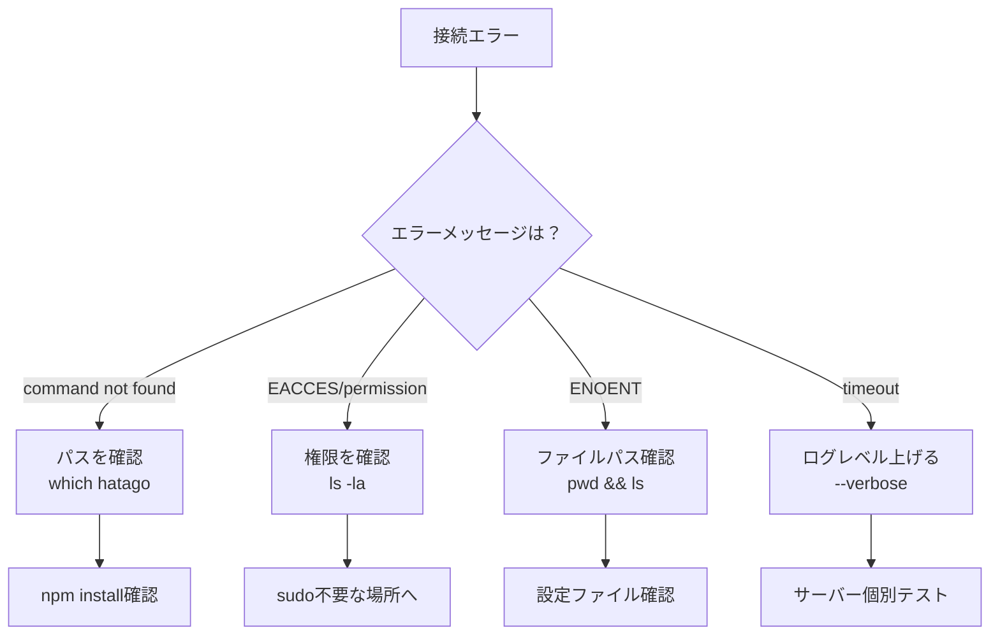

import { Card, CardGrid, Steps, Tabs, TabItem, Aside, Code } from '@astrojs/starlight/components';

既存のNode.jsプロジェクトにHatago MCP Hubを統合し、**30分以内に実運用レベル**のセットアップを完了します。このガイドは最短経路で価値を体験できるよう設計されています。

## 🎯 達成目標

このガイドを完了すると：

- ✅ 既存プロジェクトにHatagoが統合される
- ✅ 1つ以上のMCPサーバーが接続される
- ✅ タグによる環境別管理が設定される
- ✅ エラー時の自己診断ができる
- ✅ チーム共有の準備が整う

## 📋 前提条件チェック

<Steps>
1. **Node.jsバージョン確認**
   ```bash
   node --version  # v20.0.0以上が必要
   ```

2. **プロジェクトディレクトリ確認**

   ```bash
   pwd  # 既存プロジェクトのルートにいることを確認
   ls package.json  # package.jsonが存在することを確認
   ```

3. **グローバル権限確認**（オプション）
   ```bash
   npm config get prefix  # グローバルインストール先を確認
   ```
   </Steps>

## 🚀 Step 1: インストール（2分）

<Tabs>
<TabItem label="npm（推奨）">
```bash
# プロジェクトへのインストール
npm install --save-dev @himorishige/hatago-mcp-hub

# package.jsonにスクリプトを追加

npm pkg set scripts.mcp="hatago serve"
npm pkg set scripts.mcp:dev="hatago serve --tags dev --watch"
npm pkg set scripts.mcp:prod="hatago serve --tags production"

```

**期待する出力:**
```

added 15 packages in 3s

````

**失敗時:** `EACCES`エラーが出たら、`sudo`なしでインストールできる場所を確認
</TabItem>

<TabItem label="pnpm">
```bash
# プロジェクトへのインストール
pnpm add -D @himorishige/hatago-mcp-hub

# package.jsonにスクリプトを追加
pnpm pkg set scripts.mcp="hatago serve"
pnpm pkg set scripts.mcp:dev="hatago serve --tags dev --watch"
pnpm pkg set scripts.mcp:prod="hatago serve --tags production"
````

</TabItem>

<TabItem label="yarn">
```bash
# プロジェクトへのインストール
yarn add -D @himorishige/hatago-mcp-hub

# package.jsonにスクリプトを追加（手動編集が必要）

````
</TabItem>
</Tabs>

## 🔧 Step 2: 初期設定（3分）

<Steps>
1. **設定ファイル作成**
   ```bash
   npx hatago init --mode stdio
````

**期待する出力:**

```
✓ Created hatago-config.json
✓ Added example server configuration
```

2. **環境変数ファイル作成**

   ```bash
   cat > .env.local << 'EOF'
   # Hatago MCP Hub環境変数
   MCP_LOG_LEVEL=info
   NODE_ENV=development

   # APIキー（必要に応じて追加）
   # OPENAI_API_KEY=sk-...
   # GITHUB_TOKEN=ghp_...
   EOF
   ```

3. **.gitignore更新**
   ```bash
   echo -e "\n# Hatago MCP Hub\nhatago-config.local.json\n.env.local" >> .gitignore
   ```
   </Steps>

<Aside type="caution">
  `.env.local`には機密情報が含まれます。絶対にGitにコミットしないでください。
</Aside>

## 📦 Step 3: 最初のサーバー接続（5分）

ローカルファイルシステムサーバーを接続して動作確認します。

<Steps>
1. **設定ファイル編集**
   ```json title="hatago-config.json"
   {
     "$schema": "https://raw.githubusercontent.com/himorishige/hatago-mcp-hub/main/schemas/config.schema.json",
     "version": 1,
     "logLevel": "info",
     "mcpServers": {
       "filesystem-local": {
         "command": "npx",
         "args": ["-y", "@modelcontextprotocol/server-filesystem", "./src"],
         "cwd": ".",
         "tags": ["dev", "local", "filesystem"],
         "env": {
           "NODE_ENV": "${NODE_ENV:-development}"
         }
       }
     }
   }
   ```

2. **接続テスト**

   ```bash
   npm run mcp:dev
   ```

   **期待する出力:**

   ```
   🏮 Starting Hatago MCP Hub...
   ✓ Loaded configuration
   ✓ Starting server: filesystem-local
   ✓ Hub ready on stdio
   ```

3. **動作確認**
   別のターミナルで:
   ```bash
   echo '{"jsonrpc":"2.0","method":"tools/list","id":1,"params":{}}' | npx hatago serve --stdio
   ```
   </Steps>

<Card title="つまずきポイント" icon="warning">
  `command not found`エラーが出たら、`npx`が使えることを確認: `which npx`
</Card>

## 🏷️ Step 4: タグベース環境管理（5分）

開発・本番環境を分離する設定を追加します。

<Steps>
1. **マルチ環境設定**
   ```json title="hatago-config.json" ins={10-26}
   {
     "mcpServers": {
       "filesystem-local": {
         "command": "npx",
         "args": ["-y", "@modelcontextprotocol/server-filesystem", "./src"],
         "tags": ["dev", "local", "filesystem"]
       },
       
       // 開発用モックサーバー
       "mock-api": {
         "command": "node",
         "args": ["./scripts/mock-server.js"],
         "tags": ["dev", "mock", "api"],
         "disabled": false
       },
       
       // 本番用リモートサーバー
       "production-api": {
         "url": "https://api.production.example.com/mcp",
         "type": "http",
         "headers": {
           "Authorization": "Bearer ${PROD_API_TOKEN}"
         },
         "tags": ["production", "api", "remote"],
         "disabled": false
       }
     }
   }
   ```

2. **環境別起動テスト**

   ```bash
   # 開発環境（dev タグのみ）
   npm run mcp:dev

   # 本番環境（production タグのみ）
   PROD_API_TOKEN=xxx npm run mcp:prod
   ```

3. **アクティブサーバー確認**
   内部ツールで確認:
   ```json
   { "jsonrpc": "2.0", "method": "_internal_hatago_list_servers", "id": 1, "params": {} }
   ```
   </Steps>

## 🧪 Step 5: 動作検証（5分）

セットアップが正しく完了したことを確認します。

### 検証スクリプト作成

```javascript title="scripts/verify-hatago.js"
#!/usr/bin/env node

const { spawn } = require('child_process');
const readline = require('readline');

async function verifyHatago() {
  console.log('🔍 Hatago MCP Hub検証開始...\n');

  const tests = [
    {
      name: 'サーバー一覧取得',
      request: {
        jsonrpc: '2.0',
        method: '_internal_hatago_list_servers',
        id: 1,
        params: {}
      }
    },
    {
      name: 'ステータス確認',
      request: {
        jsonrpc: '2.0',
        method: '_internal_hatago_status',
        id: 2,
        params: {}
      }
    }
  ];

  const hatago = spawn('npx', ['hatago', 'serve', '--stdio'], {
    stdio: ['pipe', 'pipe', 'pipe']
  });

  const rl = readline.createInterface({
    input: hatago.stdout,
    crlfDelay: Infinity
  });

  let testIndex = 0;

  rl.on('line', (line) => {
    try {
      const response = JSON.parse(line);
      console.log(`✅ ${tests[testIndex].name}: 成功`);
      console.log(`   結果: ${JSON.stringify(response.result, null, 2)}\n`);

      testIndex++;
      if (testIndex < tests.length) {
        hatago.stdin.write(JSON.stringify(tests[testIndex].request) + '\n');
      } else {
        console.log('🎉 すべての検証が完了しました！');
        hatago.kill();
        process.exit(0);
      }
    } catch (e) {
      console.error(`❌ エラー: ${e.message}`);
      console.error(`   応答: ${line}`);
      hatago.kill();
      process.exit(1);
    }
  });

  // 最初のテスト実行
  hatago.stdin.write(JSON.stringify(tests[0].request) + '\n');
}

verifyHatago().catch(console.error);
```

実行:

```bash
node scripts/verify-hatago.js
```

**期待する出力:**

```
🔍 Hatago MCP Hub検証開始...

✅ サーバー一覧取得: 成功
   結果: {
     "servers": ["filesystem-local", "mock-api"]
   }

✅ ステータス確認: 成功
   結果: {
     "status": "ready",
     "activeServers": 2
   }

🎉 すべての検証が完了しました！
```

## 🚨 トラブルシューティング

### 診断ツリー：接続できない場合



### よくあるエラーと対処

| エラー                           | 原因                     | 対処法                           |
| -------------------------------- | ------------------------ | -------------------------------- |
| `ENOENT: hatago-config.json`     | 設定ファイルがない       | `npx hatago init`を実行          |
| `Invalid JSON`                   | 設定ファイルの構文エラー | JSONリンターで確認               |
| `Environment variable not found` | 環境変数未設定           | `.env.local`を確認、`export`する |
| `Server failed to start`         | サーバー起動失敗         | `--verbose`で詳細ログ確認        |

## 📤 Step 6: チーム共有準備（5分）

<Steps>
1. **設定テンプレート作成**
   ```bash
   cp hatago-config.json hatago-config.example.json
   # 機密情報を削除してコミット
   ```

2. **環境変数テンプレート**

   ```bash
   cp .env.local .env.example
   # 値を空にしてコミット
   ```

3. **READMEに手順追加**

   ```markdown title="README.md" ins={5-15}
   ## MCP Hub Setup

   1. Install dependencies: `npm install`
   2. Copy config: `cp hatago-config.example.json hatago-config.json`
   3. Set environment: `cp .env.example .env.local`
   4. Edit `.env.local` with your credentials
   5. Start hub: `npm run mcp:dev`
   ```

4. **チームメンバー向けドキュメント**

   ```markdown title="docs/MCP_SETUP.md"
   # Hatago MCP Hub セットアップガイド

   ## 必要な環境変数

   - `GITHUB_TOKEN`: GitHub APIアクセス用
   - `OPENAI_API_KEY`: OpenAI API用（オプション）

   ## タグの使い分け

   - `dev`: 開発環境
   - `staging`: ステージング環境
   - `production`: 本番環境

   ## トラブルシューティング

   問題が発生したら `npm run mcp:dev -- --verbose` で詳細ログを確認
   ```

   </Steps>

## ✅ 完了チェックリスト

以下がすべて完了していることを確認：

- [ ] Hatagoがインストールされている
- [ ] 設定ファイルが作成されている
- [ ] 最低1つのサーバーが接続できる
- [ ] タグによる環境分離が設定されている
- [ ] 検証スクリプトが成功する
- [ ] チーム共有の準備ができている
- [ ] .gitignoreが更新されている

## 🎯 次のステップ

おめでとうございます！基本的なセットアップが完了しました。

<CardGrid>
  <Card title="カスタムサーバー作成" icon="rocket" href="/ja/how-to/custom-server/">
    独自のMCPサーバーを実装
  </Card>
  <Card title="CI/CD統合" icon="setting" href="/ja/how-to/ci-cd-integration/">
    自動テストとデプロイ
  </Card>
  <Card title="高度な設定" icon="puzzle" href="/ja/how-to/advanced-configuration/">
    パフォーマンス最適化
  </Card>
</CardGrid>

---

<Aside type="tip">
  **サポート**: 問題が解決しない場合は[GitHub
  Issues](https://github.com/himorishige/hatago-mcp-hub/issues)で質問してください。
</Aside>
