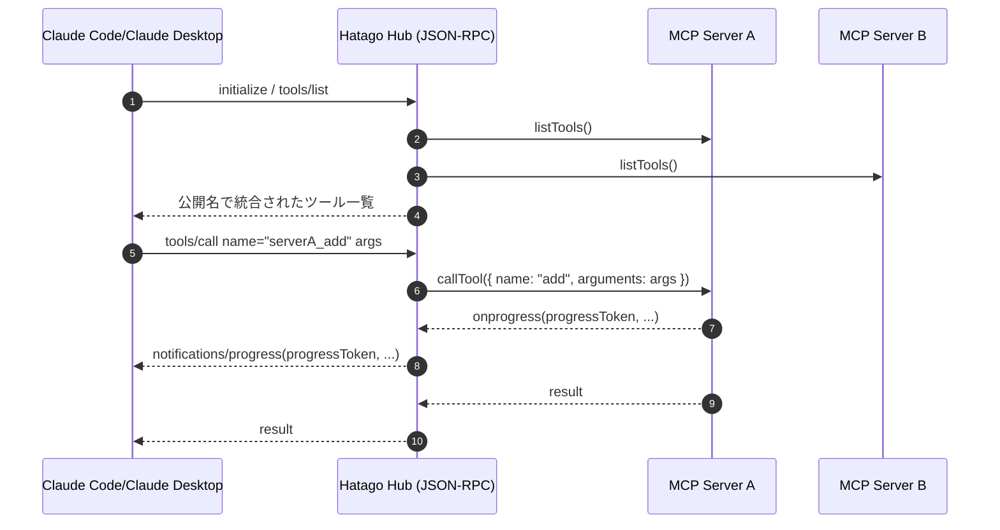
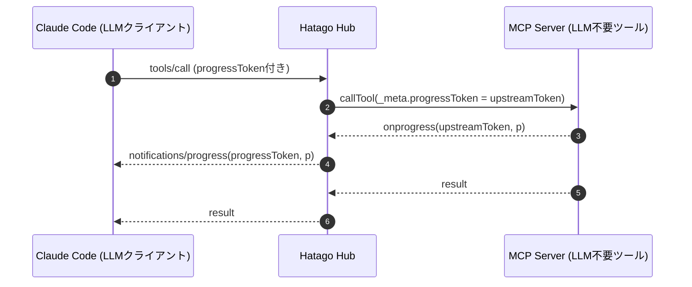
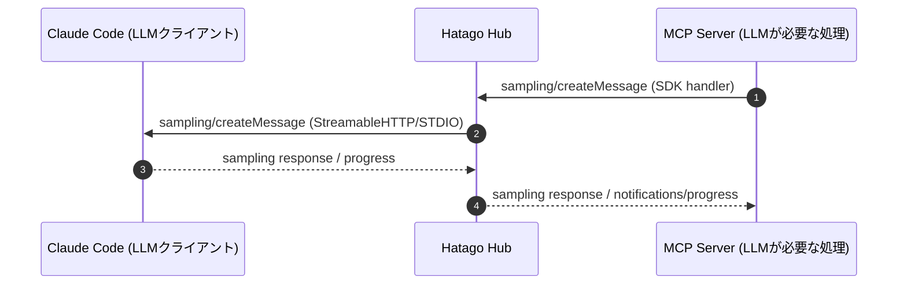

# Hatago MCP Hub コード徹底解剖：複数MCPサーバーを束ねる設計と実装

この資料は、Hatagoにおける「MCP Hub」の仕組みをコードレベルで解説する技術記事です。サーバー/ランタイム/CLIの詳細な使い方には踏み込みません。焦点は「複数のMCPサーバーを、どのような考えとコードで束ねているか」です。また、公式 TypeScript SDK（modelcontextprotocol/typescript-sdk）をどのように読み解き、Hatagoに取り込んでいるかも併せて説明します。

## 目的と前提

- 複数のMCPサーバーを単一ハブに集約し、ツール・リソース・プロンプトを一体として提供する
- ツール名の衝突を解消しつつ、呼び出しを適切な下位サーバーへ委譲する
- 進捗や通知を中継し、クライアント体験を損なわない（Claude Code等）
- 型安全かつプロトコル準拠（TypeScript SDKに依拠）

## 中核コンポーネントの全体像

Hatagoのハブは `packages/hub/src/hub.ts` の `HatagoHub` クラスが中心です。周辺として、進捗通知の `SSEManager`、内部ツール、通知管理、能力（capabilities）管理などが連携します。

```ts
// packages/hub/src/hub.ts（抜粋）
export class HatagoHub {
  protected sessions: SessionManager;
  protected toolRegistry: ToolRegistry;
  protected toolInvoker: ToolInvoker;
  protected resourceRegistry: ResourceRegistry;
  protected promptRegistry: PromptRegistry;
  protected capabilityRegistry: CapabilityRegistry;

  protected servers = new Map<string, ConnectedServer>();
  protected clients = new Map<string, Client>();
  private sseManager: SSEManager;
  private streamableTransport?: StreamableHTTPTransport;
  // ... 省略
}
```

- ツール・リソース・プロンプトをそれぞれレジストリに集約
- `ToolRegistry` は公開名（命名戦略）で衝突回避し、`ToolInvoker` が呼び出しを仲介
- `SSEManager` は長尺ツール実行時などの進捗をSSEで配信
- `StreamableHTTPTransport` はクライアント（例：Claude Desktop/Code）とのJSON-RPC中継に利用

## サーバー接続とTypeScript SDKの使い方

### どのSDK APIを使っているか

- `Client` 本体: `@modelcontextprotocol/sdk/client/index.js`
- HTTPクライアント（Streamable）: `@modelcontextprotocol/sdk/client/streamableHttp.js`
- 型（スキーマ）: `@modelcontextprotocol/sdk/types.js`（`CreateMessageRequestSchema` など）

HatagoはSDKの「高水準API」を活用します。例えば：

```ts
// packages/hub/src/hub.ts（接続確立）
const client = new Client(
  { name: `hatago-hub-${id}`, version: '0.1.0' },
  { capabilities: { tools: {}, resources: {}, prompts: {}, sampling: {} } }
);
await client.connect(transport);

// ツール・リソース・プロンプトをSDKの高水準APIで取得
const toolsResult = await client.listTools();
const resourcesResult = await client.listResources();
const promptsResult = await client.listPrompts();

// ツール呼び出し（進捗ハンドラ対応）
await client.callTool({ name: tool.name, arguments: args }, undefined, {
  onprogress: (p) => {
    /* 中継処理 */
  }
});
```

SDKのClientに依拠することで、低レイヤのJSON-RPC詳細を自前実装せず、プロトコル準拠と保守性を両立しています。

### トランスポート選択（複数サーバーへの接続）

`ServerSpec` に応じて適切なトランスポートを選択します：

```ts
// packages/hub/src/hub.ts（抜粋）
if (spec.command) {
  // ローカル（stdio）
  const { StdioClientTransport } = await import('@hatago/transport/stdio');
  return new StdioClientTransport({
    command: spec.command,
    args: spec.args,
    env: spec.env,
    cwd: spec.cwd
  });
} else if (spec.url && spec.type === 'sse') {
  // リモート（SSE）
  return new SSEClientTransport(new URL(spec.url));
} else if (spec.url && spec.type === 'streamable-http') {
  // リモート（Streamable HTTP）
  const { StreamableHTTPClientTransport } = await import(
    '@modelcontextprotocol/sdk/client/streamableHttp.js'
  );
  return new StreamableHTTPClientTransport(new URL(spec.url));
}
```

接続は `connectWithRetry`（指数バックオフ）で安定化し、`fallbackNotificationHandler` でサーバーからの通知をHub経由でクライアントへ中継します。

## ツールの集約・命名・実行

### 命名戦略で衝突回避

複数サーバーの同名ツール衝突を防ぐため、`ToolRegistry` が公開名を生成します。デフォルトは `namespace` 戦略で、`<serverId>_<toolName>` 形式に。区切り文字は設定可能（`separator`）。

```ts
// packages/hub/src/hub.ts（接続時の一括登録）
const toolsWithHandlers = toolArray.map((tool) => ({
  ...tool,
  handler: async (args: any, progressCallback?: any) => {
    return await client.callTool({ name: tool.name, arguments: args }, undefined, {
      onprogress: async (progress) => {
        /* 進捗を転送 */
      }
    });
  }
}));
this.toolRegistry.registerServerTools(id, toolsWithHandlers);
// 公開名でハンドラ登録
for (const [i, reg] of this.toolRegistry.getServerTools(id).entries()) {
  this.toolInvoker.registerHandler(reg.name, toolsWithHandlers[i].handler);
}
```

クライアントからは、公開名（例：`math-server_add`）で呼び出せば、Hubが正しいサーバーへ委譲します。

### 進捗の中継（SSE/通知）

`onprogress` で受けた進捗は、以下の経路でクライアントに届けます：

- `notifications/progress` をJSON-RPC通知として上位クライアントへ送信（STDIO/Streamable HTTP）
- `SSEManager` によるSSEでのプッシュ（ブラウザ/Workers等）

さらに `tools/call` をHubのJSON-RPCで受けた場合、`progressToken` があるときは「直接下位クライアントへ転送するモード」に切り替えて、ダブル配信を避けつつ即時に進捗をリレーします。

```ts
// packages/hub/src/hub.ts（tools/call内：直接転送ルート）
if (this.streamableTransport && serverId && progressToken) {
  const result = await (client as any).callTool(
    {
      name: toolName,
      arguments: params.arguments,
      _meta: { progressToken: upstreamToken }
    },
    undefined,
    {
      onprogress: async (progress) => {
        /* progressTokenでそのまま上流へ転送 */
      }
    }
  );
  return { jsonrpc: '2.0', id, result };
}
```

## リソース・プロンプトの集約と名前解決

- リソースは `ResourceRegistry` が `serverId:URI` 形式で集約し、読み出し時に元URIへ解決して該当サーバーへ転送
- プロンプトは `PromptRegistry` に集約し、公開名で取得できるように命名（`<serverId>_<promptName>`）

```ts
// packages/hub/src/hub.ts（リソース読み）
const info = this.resourceRegistry.resolveResource(uri);
const client = this.clients.get(info.serverId);
return await client.readResource({ uri: info.originalUri });
```

## サーバー→クライアント（LLM）方向の橋渡し：sampling/createMessage

TypeScript SDKの `CreateMessageRequestSchema` を使い、下位サーバーからの `sampling/createMessage` 要求（LLMへの生成依頼）を捕捉して、上位クライアントへ中継します。

```ts
// packages/hub/src/hub.ts（接続後にハンドラ登録）
(client as any).setRequestHandler(CreateMessageRequestSchema, async (request) => {
  // クライアント側のcapabilitiesを確認（sampling非対応なら明確なエラー）
  const clientCaps = this.capabilityRegistry.getClientCapabilities('default');
  if (!clientCaps.sampling) throw new Error('Sampling not supported');

  // StreamableHTTP経由で上位へ転送し、対応するレスポンスを待つ
  const samplingId = `sampling-${Date.now()}-${Math.random().toString(36).slice(2)}`;
  return await new Promise((resolve, reject) => {
    (this as any).samplingSolvers = (this as any).samplingSolvers || new Map();
    (this as any).samplingSolvers.set(samplingId, {
      resolve,
      reject,
      progressToken: request.params?._meta?.progressToken,
      serverId: id
    });
    this.streamableTransport
      ?.send({
        jsonrpc: '2.0',
        id: samplingId,
        method: 'sampling/createMessage',
        params: request.params
      })
      .catch(reject);
    setTimeout(() => {
      /* タイムアウト処理 */
    }, 30000);
  });
});
```

上位から返る `sampling-...` のレスポンスは `onmessage` で受け取り、`samplingSolvers` で対応付けて解決します。`notifications/progress` は対応するサーバーへ折り返し転送します（Hubが「橋」の役目）。

## JSON-RPCエンドポイント（Hubとしての表面）

Hubはクライアント（Claude Code等）に対してJSON-RPCで以下を提供します：

- `initialize` / `notifications/initialized`
- `tools/list` / `tools/call`
- `resources/list` / `resources/read` / `resources/templates/list`
- `prompts/list` / `prompts/get`
- `notifications/progress`（受信時の橋渡し）
- `ping`

実装は `handleJsonRpcRequest` に集約され、必要に応じて `SSEManager` や `StreamableHTTPTransport` と連携します。

## ホットリロード（設定変更の即時反映）

Hatagoは設定ファイルの変更を自動検知して安全に反映します。主なエントリポイントは `setupConfigWatcher` と `reloadConfig` です。

```ts
// packages/hub/src/hub.ts（監視のセットアップ）
private async setupConfigWatcher(): Promise<void> {
  const { watch } = await import('node:fs');
  const configPath = resolve(this.options.configFile);
  let reloadTimeout: NodeJS.Timeout | undefined;

  this.configWatcher = watch(configPath, async (eventType) => {
    if (eventType === 'change') {
      if (reloadTimeout) clearTimeout(reloadTimeout);
      reloadTimeout = setTimeout(async () => {
        await this.reloadConfig(); // 実体
      }, 1000); // 1秒デバウンス
    }
  });
}
```

`reloadConfig` は次の順序で処理します。

- JSON読み込み → Zodで検証（`@hatago/core/schemas`）
- 既存と新設定のサーバー集合を比較
  - 新設定にないサーバーは `removeServer`
  - 追加/変更されたサーバーは `addServer`（既存は差分検出で再接続）
- 通知（`NotificationManager`）で状態を発行（starting/connected/error、rate limit対応）
- `tools/list_changed` 通知でクライアントへ更新を明示

```ts
// packages/hub/src/hub.ts（抜粋）
private async reloadConfig(): Promise<void> {
  const config = parseAndValidate(); // Zod
  const newServerIds = new Set(Object.keys(config.mcpServers || {}));
  const existingServerIds = new Set(this.servers.keys());

  // 削除
  for (const id of existingServerIds) {
    if (!newServerIds.has(id)) await this.removeServer(id);
  }

  // 追加・差分反映
  for (const [id, serverConfig] of Object.entries(config.mcpServers || {})) {
    if ((serverConfig as any).disabled) {
      if (existingServerIds.has(id)) await this.removeServer(id);
      continue;
    }
    const spec = this.normalizeServerSpec(serverConfig as any);
    if (existingServerIds.has(id)) {
      const existing = this.servers.get(id);
      if (existing && JSON.stringify(existing.spec) !== JSON.stringify(spec)) {
        await this.removeServer(id);
        await this.addServer(id, spec);
      }
    } else {
      await this.addServer(id, spec);
    }
  }

  this.notificationManager?.notifyConfigReload(true);
  await this.sendToolListChangedNotification();
}
```

これにより、設定ファイル更新時にサーバー群・ツール一覧が自動的に整合され、クライアントは最新のツールセットを確実に取得できます。

## Internal Tools（運用向け自己管理ツール）

Hub自身を操作・観測するための内部ツール群を同梱しています。`_internal` サーバーIDとして登録され、通常のツールと同様に呼び出せます。

登録処理は `registerInternalTools` で行われ、ZodスキーマをJSON Schema化して公開します。

```ts
// packages/hub/src/hub.ts（内部ツール登録）
private async registerInternalTools(): Promise<void> {
  const { getInternalTools } = await import('./internal-tools.js');
  const { zodToJsonSchema } = await import('./zod-to-json-schema.js');
  const tools = getInternalTools().map((tool) => ({
    name: tool.name,
    description: tool.description,
    inputSchema: zodToJsonSchema(tool.inputSchema),
    handler: async (args) => tool.handler(args, this),
  }));
  this.toolRegistry.registerServerTools('_internal', tools);
  // 公開名（例: _internal_hatago_status）でhandler登録
}
```

実装済みの代表例：

- `hatago_status`: サーバー状態・ツール総数・リビジョン/ハッシュを返す
- `hatago_reload`: 設定の再読み込み（`reloadConfig` 呼び出し）。`dry_run` オプションあり
- `hatago_list_servers`: 接続サーバー一覧（URL/command、ツール/リソース数、エラーなど）

```ts
// packages/hub/src/internal-tools.ts（抜粋）
export function getInternalTools(): InternalTool[] {
  return [
    {
      name: 'hatago_status',
      inputSchema: z.object({}),
      handler: async (_args, hub) => ({
        /* 概要 */
      })
    },
    {
      name: 'hatago_reload',
      inputSchema: z.object({ dry_run: z.boolean().optional() }),
      handler: async (args, hub) => hubReload(hub, args)
    },
    {
      name: 'hatago_list_servers',
      inputSchema: z.object({}),
      handler: async (_args, hub) => ({
        /* 一覧 */
      })
    }
  ];
}
```

命名戦略により、公開名は通常 `_internal_<name>` となります。例：`_internal_hatago_status`。クライアントからは他ツールと同じ手順で呼び出せます。

## フロー図：Claude Code → Hatago → 複数MCPサーバー







## Claude CodeからInternal Toolsを呼び出す（実例）

前提として、Claude Code（またはClaude Desktop）がHatago Hubに接続済みであることを想定します（Hatago HubをMCPサーバーとして登録）。Internal Toolsは `_internal` 名前空間で公開されるため、既定設定では以下の公開名になります。

- `_internal_hatago_status`
- `_internal_hatago_reload`
- `_internal_hatago_list_servers`

### 方法A: Claude Codeのツール一覧から実行

1. Claude Codeの「Tools」パネルでツール一覧を開く
2. `_internal_hatago_status` 等を検索
3. 引数（必要なら）を入力して実行

実行結果は通常のMCPツール結果と同様に、テキスト/構造化レスポンスとして表示されます。

### 方法B: Chatから直接指示

- 例: 「`_internal_hatago_status` を実行して、接続中のサーバー一覧を見せて」
- 例: 「`_internal_hatago_reload` を `{"dry_run": true}` で呼び出して」

Claude CodeはMCPツール名を解釈し、該当ツールを呼び出します。

### 参考：JSON-RPCリクエスト例（低レベル）

ツール一覧の取得:

```json
{ "jsonrpc": "2.0", "id": 1, "method": "tools/list", "params": {} }
```

Internal Toolsの呼び出し（ステータス取得）:

```json
{
  "jsonrpc": "2.0",
  "id": 2,
  "method": "tools/call",
  "params": { "name": "_internal_hatago_status", "arguments": {} }
}
```

サンプル応答（概略）:

```json
{
  "jsonrpc": "2.0",
  "id": 2,
  "result": {
    "content": [
      {
        "type": "text",
        "text": "{\n  \"hub_version\": \"0.2.0\",\n  \"toolset\": { \"revision\": 12, \"hash\": \"abcd1234...\" },\n  \"servers\": { \"total\": 3, \"list\": [/* ... */] }\n}"
      }
    ]
  }
}
```

内部ツール名は命名戦略に依存します。デフォルトは `namespace` で、`_internal_<name>` となります。`namingStrategy: 'none'` を使う場合は `hatago_status` など元名で公開されます。

## 設定例：Claude Code用 `.mcp.json` と Codex CLI用 `config.toml`

### Claude Code用 `.mcp.json`（ローカルでHatagoをstdio起動）

最小構成（`@hatago/cli` 経由）。`<ABSOLUTE_PATH>` は自環境に合わせて置換してください。

```json
{
  "mcpServers": {
    "hatago": {
      "command": "npx",
      "args": [
        "hatago",
        "serve",
        "--stdio",
        "--config",
        "<ABSOLUTE_PATH>/claude-with-everything.config.json"
      ]
    }
  }
}
```

代替（`@hatago/server` 直接）。ホットリロードするなら `--watch` を付与：

```json
{
  "mcpServers": {
    "hatago": {
      "command": "npx",
      "args": [
        "hatago-server",
        "--stdio",
        "--watch",
        "--config",
        "<ABSOLUTE_PATH>/claude-with-everything.config.json"
      ]
    }
  }
}
```

参考: このリポジトリの `docs/mcp-config-examples.md` に同趣旨の例があります。

### Codex CLI用 `config.toml`（例）

Codex CLIからHatago HubをMCPとして利用するための一例です。Codex CLIの設定場所・キーは環境により異なる場合がありますが、以下のように「stdio起動するHatago」または「リモートSSEのHatago」に接続できます。

stdioでHatagoを起動して接続する例：

```toml
[mcp.servers.hatago]
type = "stdio"
command = "npx"
args = [
  "hatago",
  "serve",
  "--stdio",
  "--config",
  "<ABSOLUTE_PATH>/claude-with-everything.config.json"
]
# 任意の環境変数
# env.NODE_OPTIONS = "--max-old-space-size=4096"
```

SSEでホストされたHatagoに接続する例（WorkersやNodeのHTTP/SSEエンドポイント）：

```toml
[mcp.servers.hatago]
type = "sse"
url = "http://localhost:8787/mcp"

# 認証が必要な場合（任意）
# [mcp.servers.hatago.headers]
# Authorization = "Bearer ${HUB_TOKEN}"
```

補足:

- stdio方式はローカルで`npx hatago serve --stdio`を子プロセス起動します。
- SSE方式は `packages/hub/src/hub.ts` の `handleMCPEndpoint`（サーバー側実装）に相当するHTTPエンドポイントへ接続します。
- 実パスは絶対パス推奨。環境変数展開（`${VAR}`/`${VAR:-default}`）はHatagoの設定ファイル側でサポートしています。

## シンプル実装例（examples/）への言及

Hatagoの最小構成の使い方は、以下の2つの例がわかりやすい参考になります。

### Node.js最小例: `examples/node-example/src/index.ts`

要点:

- `createHub({ configFile })` でHubを生成し、`hub.start()` で設定を読み込み接続
- HonoでHTTPサーバーを立て、`/mcp` に `handleMCPEndpoint(hub, c)` を割り当て
- 進捗通知用に `createEventsEndpoint(hub)` を `/sse` に割り当て（SSE対応）
- ヘルスチェック `/health` も同梱

関係ファイル:

- 実装: `examples/node-example/src/index.ts`
- 設定: `examples/node-example/hatago.config.json`

実行例:

```bash
pnpm -r build
node examples/node-example/src/index.ts
# MCP:  http://127.0.0.1:3000/mcp
# SSE:  http://127.0.0.1:3000/sse
```

この例はローカル開発でのHTTP/SSE連携の最小サンプルで、進捗通知の動作確認にも適しています。

### Cloudflare Workers最小例: `examples/workers-simple-example/src/index.ts`

要点:

- Workers環境（プロセスspawn不可）向けの最小実装
- 各リクエストで `createHub()` → 設定のMCPサーバーを `addServer` → `handleMCPEndpoint`
- シンプルさ優先のためSSEは未実装（進捗は省略）

関係ファイル:

- 実装: `examples/workers-simple-example/src/index.ts`
- 設定: `examples/workers-simple-example/src/hatago.config.ts`（リモートMCPのみ）

実行例（概念）:

```bash
pnpm -r build
# wranglerでデプロイ/プレビュー（詳細は同ディレクトリのREADME参照）
```

Workers版はスケールやコールドスタートに耐えるシンプル構成で、リモートMCP（例: DeepWiki）に接続するパターンを示します。

## スクリーンショットガイド（配置・撮り方）

以下の画像を用意して本ドキュメントから参照できるようにしています。`docs/images/` 配下にPNGで保存してください（ファイル名は任意ですが下記を推奨）。

- `docs/images/claude-tools-internal.png`: Claude CodeのToolsパネルで`_internal_hatago_*`が並ぶ様子
- `docs/images/claude-status-result.png`: `_internal_hatago_status` 実行後の結果ビュー
- `docs/images/node-example-start.png`: Node最小例起動時のターミナル（エンドポイント表示）
- `docs/images/health-endpoint.png`: ブラウザで`/health`を開いた表示
- `docs/images/progress-notification.png`: 長尺ツール呼び出し時の進捗通知が見えるUI
- `docs/images/workers-dev-health.png`: Workers最小例の`/health`表示（wranglerプレビュー等）

本文への貼り付け例:

```md


```

撮影のコツ:

- macOS: `Shift + Cmd + 4` で選択キャプチャ、または `screencapture -i ~/Desktop/shot.png`
- Linux: `gnome-screenshot -a` などディストリビューション標準のツールを利用
- 画像は横幅1200px前後を目安に、不要部分をトリミングして可読性を確保
- 進捗通知は、`tools/call` に `progressToken` が付与されるツール（例: ファイル処理）で確認すると映えます

参考の貼り込み地点:

- 「Claude CodeからInternal Toolsを呼び出す（実例）」直下にInternal Toolsの2枚
- 「シンプル実装例（examples/）への言及」の各小節末尾に、起動ターミナルと`/health`の2枚

## 実装上の判断とSDKの読み解きポイント

- SDKの高水準メソッド（`listTools`, `callTool`, `listResources`, `readResource`, `listPrompts`, `getPrompt`）を「そのまま」使うことで、ローレベルのメッセージ整形を避け、プロトコル準拠を担保
- `CreateMessageRequestSchema` は「サーバー→クライアント」方向の希少ルート（sampling）を橋渡しする要点。SDKのスキーマから逆読みし、Hubが中継器になる設計を採用
- `fallbackNotificationHandler` により、下位サーバー発の通知（ログ、進捗等）をHubが受けて、必要に応じて上位へ再送
- 命名戦略は「Claude Code互換性」を考慮し、デフォルトでアンダースコア区切りを採用（ドットは置換）

## 付録：主なコード参照

- Hub本体: `packages/hub/src/hub.ts`
- 型とサーバー仕様: `packages/hub/src/types.ts`
- 進捗配信: `packages/hub/src/sse-manager.ts`
- 内部管理ツール: `packages/hub/src/internal-tools.ts`
- 通知管理: `packages/hub/src/notification-manager.ts`
- エラー/互換: `packages/hub/src/errors.ts`
- SDK参照: `@modelcontextprotocol/sdk/client/index.js`, `@modelcontextprotocol/sdk/client/streamableHttp.js`, `@modelcontextprotocol/sdk/types.js`

---

この資料は、技術ブログや発表資料からの引用を想定し、コードとファイルパスを明示しました。より広いアーキテクチャや設定の詳細は、リポジトリの `docs/ARCHITECTURE.md` および `docs/configuration.md` を参照してください。
