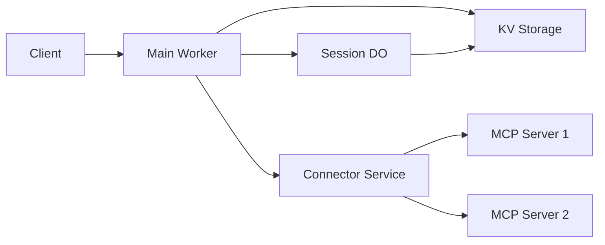

# Hatago MCP Hub for Cloudflare Workers

A Cloudflare Workers implementation of the Hatago MCP Hub, optimized for edge computing with support for remote MCP servers via HTTP/SSE.

## 🚀 Features

- **Edge-native**: Runs on Cloudflare Workers global network
- **Streaming Support**: Unlimited wall-clock time for long-running operations
- **Session Management**: Durable Objects for strong consistency
- **Configuration Storage**: KV Storage for read-optimized config access
- **Connection Pooling**: Service Bindings to avoid 6-connection limit
- **WebSocket Support**: Real-time bidirectional communication with hibernation

## 📋 Prerequisites

- Cloudflare account with Workers enabled
- Wrangler CLI installed (`npm install -g wrangler`)
- Node.js 20+ for local development

## 🛠️ Setup

### 1. Install Dependencies

```bash
pnpm install
```

### 2. Configure Wrangler

Update `wrangler.toml` with your account details:

```toml
account_id = "your-account-id"
```

### 3. Create KV Namespaces

```bash
# Create KV namespaces
wrangler kv:namespace create CONFIG_KV
wrangler kv:namespace create CACHE_KV

# For preview/development
wrangler kv:namespace create CONFIG_KV --preview
wrangler kv:namespace create CACHE_KV --preview
```

Update the IDs in `wrangler.toml` with the values from the output.

### 4. Configure MCP Servers

Upload your configuration to KV:

```bash
# Create config file
cat > config.json << EOF
{
  "version": "0.1.0",
  "mcpServers": {
    "example-server": {
      "id": "example-server",
      "url": "https://your-mcp-server.com",
      "type": "sse",
      "headers": {
        "Authorization": "Bearer your-token"
      }
    }
  }
}
EOF

# Upload to KV
wrangler kv:key put --namespace-id=your-config-kv-id hub-config "$(cat config.json)"
```

## 🚦 Development

```bash
# Start local development server
pnpm dev

# Deploy to production
pnpm deploy

# View logs
pnpm tail
```

## 🏗️ Architecture

### Core Components

1. **Main Worker** (`src/index.ts`)
   - Hono-based HTTP router
   - Handles MCP protocol endpoints
   - SSE streaming for progress notifications

2. **Session Durable Object** (`src/session.do.ts`)
   - Strong consistency for session state
   - WebSocket hibernation for cost efficiency
   - Alarm API for session expiration

3. **Connector Service** (`src/connector-http.ts`)
   - Isolated service for MCP server connections
   - Avoids 6-connection limit through Service Bindings
   - Handles HTTP/SSE streaming with backpressure

4. **Configuration Manager** (`src/config.ts`)
   - KV Storage for read-optimized access
   - Write aggregation through Durable Objects
   - Handles KV's eventual consistency

### Request Flow



## 🔧 Configuration

### Environment Variables

- `LOG_LEVEL`: Logging level (debug, info, warn, error)
- `HUB_VERSION`: Hub version string

### KV Storage Structure

```
hub-config          # Main configuration
server:{id}         # Individual server configs
session:{id}        # Session snapshots (cache)
```

## ⚡ Performance Considerations

### Streaming Without Limits

Workers has **no wall-clock time limit** for streaming responses:

- CPU time: Max 5 minutes per request
- Streaming: Unlimited duration
- Use `ReadableStream` for efficient memory usage

### Connection Management

To avoid the 6 concurrent connection limit:

1. Use Service Bindings to isolate connections
2. Implement connection pooling
3. Queue requests when approaching limits

### Cost Optimization

1. **Durable Objects**: Use WebSocket hibernation
2. **KV Storage**: Cache frequently read data
3. **Service Bindings**: Reduce external fetch costs

## 🚫 Limitations

### Not Supported

- ❌ Local MCP server spawning (no child_process)
- ❌ STDIO transport (no file system access)
- ❌ NPX server launching

### Supported

- ✅ Remote HTTP/SSE MCP servers
- ✅ Unlimited streaming duration
- ✅ WebSocket connections
- ✅ Progress notifications
- ✅ Session persistence

## 📊 Monitoring

### Health Check

```bash
curl https://your-worker.workers.dev/health
```

### Metrics

View in Cloudflare Dashboard or use:

```bash
wrangler tail
```

## 🔐 Security

1. **Authentication**: Implement at edge before DO
2. **Rate Limiting**: Use Cloudflare Rate Limiting
3. **Secrets**: Store in Workers Secrets, not KV

```bash
wrangler secret put API_KEY
```

## 🚀 Deployment

### Production Deployment

```bash
# Deploy to production
wrangler deploy --env production

# Set custom domain
wrangler route add your-domain.com/*
```

### Rollback

```bash
# List deployments
wrangler deployments list

# Rollback to previous
wrangler rollback
```

## 📝 Notes on Workers Runtime

### Key Differences from Node.js

1. **No File System**: Use KV/R2/DO for storage
2. **No Process Spawning**: Remote servers only
3. **Web Standards**: Fetch API, Streams, WebCrypto
4. **Request Context**: Each request is isolated

### Best Practices

1. **Use Streaming**: For large responses
2. **Cache Aggressively**: KV and Cache API
3. **Minimize Subrequests**: Batch when possible
4. **Handle Failures**: Implement retry logic

## 🤝 Contributing

This is an example implementation demonstrating Workers capabilities for MCP Hub. Contributions and improvements are welcome!

## 📄 License

Same as the main Hatago project.
